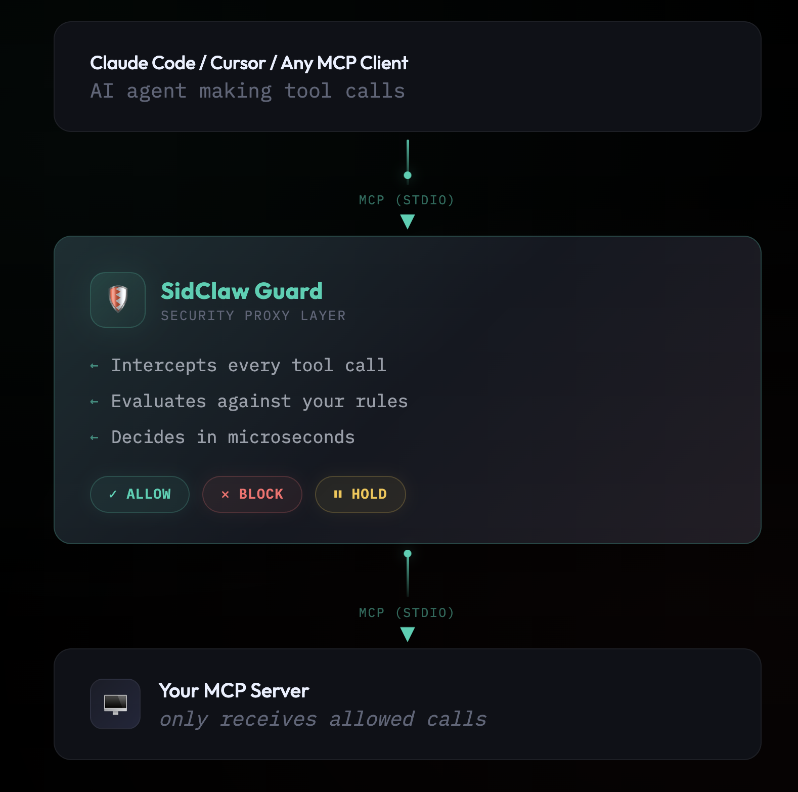

<p align="center">
  
</p>

<h1 align="center">sidclaw-mcp-guard</h1>

<p align="center">
  <strong>Stop AI agents from doing dangerous things through MCP.</strong>
  <br />
  <em>Wraps any MCP server. Allows safe calls. Blocks dangerous ones. Holds the rest for you.</em>
</p>

<p align="center">
  
  
  
</p>

<p align="center">
  
</p>

---

## Get started

### See it in action (30 seconds)

```bash
npx sidclaw-mcp-guard@latest demo
```

### Set up a real guarded MCP server (2 minutes)

```bash
npx sidclaw-mcp-guard@latest quickstart
```

Creates a config, starts the approval dashboard, and prints the MCP config to paste into Claude Code or Cursor.

<!-- TODO: terminal recording GIF -->

---

## How it works

<p align="center">
  
</p>

---

## Policy rules — no regex needed

Rules use **semantic patterns** — human-readable shortcuts instead of raw regex:

```yaml
# sidclaw.config.yaml

rules:
  - name: allow-reads
    description: Read-only queries are safe
    match:
      pattern: sql-read           # SELECT, EXPLAIN, SHOW
    action: allow

  - name: approve-writes
    description: Data changes need approval
    match:
      pattern: sql-write          # INSERT, UPDATE, DELETE
    action: approve

  - name: deny-destructive
    description: Schema changes are never allowed
    match:
      pattern: sql-destructive    # DROP, TRUNCATE, ALTER, CREATE
    action: deny

default: deny
```

Available patterns: `sql-read`, `sql-write`, `sql-destructive`, `file-read`, `file-write`, `file-delete`.

Power users can still use regex via `match.args` — see [docs/config.md](docs/config.md).

---

## Approve from your browser

Every guard instance can run a local approval dashboard:

```bash
sidclaw-mcp-guard --ui --upstream npx --upstream-args "..."
```

Open `http://localhost:9091` — see pending requests, approve or deny with one click, inspect the audit trail.

<!-- TODO: screenshot of approval dashboard -->

Or use the CLI: `npx sidclaw-mcp-guard approve <id>`

---

## Plain-English explanations

Every decision explains itself:

```
✔ ALLOW   SELECT * FROM users
  Allowed: read query on users. Read-only queries are safe.

⏳ HOLD    DELETE FROM users WHERE id = 42
  Held for approval: delete from users. Data changes need approval.

✘ BLOCK   DROP TABLE users
  Blocked: drop users. Schema changes are never allowed.
```

Explanations appear in the terminal, dashboard, and audit log.

---

## Observe mode

Test your policies without blocking anything:

```bash
sidclaw-mcp-guard --observe --upstream npx --upstream-args "..."
```

The guard evaluates every call and logs what it *would* do, but forwards all calls regardless. Switch to enforce mode when ready.

---

## Audit trail

Every decision is logged to `.sidclaw/audit.jsonl`:

```jsonl
{"timestamp":"...","tool":"query","args":{"sql":"SELECT * FROM users"},"decision":"allow","rule":"allow-reads","explanation":"Allowed: read query on users. Read-only queries are safe."}
{"timestamp":"...","tool":"query","args":{"sql":"DELETE FROM users WHERE id=42"},"decision":"approve","rule":"approve-writes","status":"approved","explanation":"Held for approval: delete from users. Data changes need approval."}
{"timestamp":"...","tool":"query","args":{"sql":"DROP TABLE users"},"decision":"deny","rule":"deny-destructive","explanation":"Blocked: drop users. Schema changes are never allowed."}
```

---

## Works with any MCP server

| Server | What you're guarding | Example config |
|--------|---------------------|----------------|
| `@modelcontextprotocol/server-postgres` | SQL queries | [examples/sql-demo](examples/sql-demo/) |
| `@modelcontextprotocol/server-filesystem` | File operations | [examples/filesystem-demo](examples/filesystem-demo/) |
| `@modelcontextprotocol/server-github` | Repo operations | |
| Any custom MCP server | Any tool calls | |

---

## CLI

```bash
# Get started
sidclaw-mcp-guard quickstart                   Set up a real guarded MCP server
sidclaw-mcp-guard demo                         Quick policy showcase
sidclaw-mcp-guard demo -i                      Interactive — try your own SQL

# Run
sidclaw-mcp-guard --upstream <cmd>             Start the guard proxy
sidclaw-mcp-guard --ui                         Start proxy + approval dashboard
sidclaw-mcp-guard --observe                    Observe mode (log only)

# Approvals
sidclaw-mcp-guard ui                           Open the approval dashboard
sidclaw-mcp-guard approve <id>                 Approve a pending request
sidclaw-mcp-guard deny <id>                    Deny a pending request
sidclaw-mcp-guard list                         List pending approvals
sidclaw-mcp-guard clean                        Remove stale approval files
```

---

## Full Platform

SidClaw Guard is the local-first entry point to [SidClaw](https://sidclaw.com). When you need more:

| Need | SidClaw Guard (this) | SidClaw Platform |
|------|---------------------|------------------|
| Policy rules | YAML with semantic patterns | Visual policy editor |
| Approvals | Local dashboard + CLI | Dashboard + Slack + Teams + Telegram |
| Audit trail | Local JSONL | Hash-chained, exportable, compliance-ready |
| Team workflows | Single user | Multi-reviewer, role-based access |
| Integrations | MCP servers | 15+ SDKs (LangChain, Vercel AI, CrewAI...) |

[Learn more at sidclaw.com →](https://sidclaw.com)

---

## Docs

- [Quick Start](docs/quickstart.md)
- [SQL Demo](docs/sql-demo.md)
- [Config Reference](docs/config.md)
- [How It Works](docs/how-it-works.md)
- [FAQ](docs/faq.md)

---

## License

Apache 2.0
